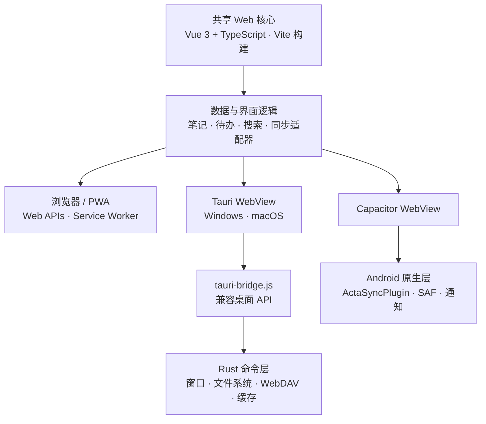

<p align="right">
  <strong>简体中文</strong> · <a href="./README_EN.md">English</a>
</p>

<p align="center">
  
</p>

<p align="center">
  <strong>当前版本 v3.5.0</strong>
</p>

Acta 是一个本地优先的笔记与待办应用，把记录、行动和资料整理放在一个安静的工作空间中。项目共用一套 Web 界面，并通过 Tauri 提供 Windows/macOS 桌面版、通过 Capacitor 提供 Android 版，也可以作为 PWA 在现代浏览器中运行。


## 功能

- 笔记与待办双向关联，可从任一编辑器建立、跳转或解除关系
- 高、中、低三级待办优先级，以及子任务、进度、创建时间、可选开始时间和截止时间
- 打卡式待办：创建菜单与速记均可生成，编辑器内每天打卡并展示连续/累计天数与最近 7 天记录，可设置开始/截止日期并进入日历，列表卡片显示今日打卡徽标
- 顺序子待办可上下移动按钮或直接拖动行首序号调整先后，勾选某一步时自动完成此前未勾选的步骤；子任务勾选时记录完成时刻并在勾选框旁显示日期（悬停查看精确到秒的时刻，可在设置中关闭）；无序模式勾选后行原地停留片刻，再滑入或淡出入底部折叠分组（与列表的已完成待办共用延迟设置）；点击「添加子任务」后自动聚焦新行并滚动到位；归类视图提供「显示已完成」切换；完成的待办会延迟片刻再收尾（延迟时长与开关见待办设置），留出撤回时间：在已完成项仍显示的视图里以流畅的非线性动效移到列表末尾，收集箱等视图则停留后淡出
- 操作历史记录：左下角入口按时间倒序回溯最近的操作（创建、删除、完成、打卡、子任务变动、归类新建等，最多 500 条），涉及具体项目的条目经二级确认可把该项目恢复到此操作之前的状态；「数据统计」移入行记数据设置页；删除子任务需经按钮展开的二级确认
- 顺序子待办：开启「顺序执行」后子任务按序号排列，可上下移动调整先后；默认保持无序模式
- 子任务批量添加与导出：编辑器任务进度行提供「快速添加子任务」（每行一条，粘贴多行清单一键追加）与「导出子任务」（分行文字或 Markdown 任务清单，可复制到剪贴板或导出 TXT / Markdown 文件）
- 取代“今天”页面的年、月、周、日日历：月视图显示周数并紧凑浏览，桌面与移动周视图独立滚动，周/日可直接完成或撤销待办与子待办
- 总结页面（原统计）：按指定时间段收集创建的待办与笔记，完整列出每条子待办，可勾选部分条目一键生成清单图片；侧边栏左下角另有「数据统计」弹窗，汇总数据档案的文件总大小、文件数、笔记、待办、归类与回收站数量
- 笔记编辑器基准字号滑块，正文与各级标题一起缩放；标题字号、标题字体独立可调（衬线、圆体、等宽或自定义字体），正文行间距与段落块间距分别用滑块调节；可视化编辑中键入 Markdown 语法（标题、列表、引用、粗斜体等）即时生效
- 首次启动 OOBE 引导：依次设置软件数据文件夹、主题与界面字体和启动动画，可随时在常规设置中重新运行；软件数据位置可随时更改；应用图标更换为 Android 专属功能，提供四款内置预设（桌面端固定使用打包默认图标）
- MWS 浅色 / MWS 深色品牌主题（主色 #FF6666、副色 #66CC66；浅色主题侧边栏与标题栏按品牌色铺装），以及三款可预览的启动动画与播放速度调节
- 删除项目时可选移入回收站或直接删除；回收站永不自动倾倒，可随时恢复、彻底删除或清空
- 文件夹、智能视图、待办/笔记组合筛选和统一搜索
- 富文本编辑与 UTF-8 Markdown 单笔记导入、导出
- 桌面端自定义右键菜单：不透明菜单面板，文本处提供剪切、复制、粘贴与全选，选中文字即可复制
- 简体中文、繁体中文和英文界面，以及多种主题和字体设置
- 全部下拉列表、滚动条、滑杆、日期时间选择器与设置勾选开关均为自绘控件，悬停反馈以缩放呈现，动效克制顺滑
- 本地数据文件夹、WebDAV 与 Acta 局域网同步（BETA）：桌面与 Android 客户端可自动搜寻同一局域网中的其他 Acta 设备直接互传完整数据文件夹；发送与导入均可选择双方具体的行记数据档案，写入方式可选替换某一档案或复制为新档案；推送采用两段式确认（对方先收到通知、查看详情后再确认），开启「信任此局域网」的设备可自动确认；传输过程逐步显示步骤与已接收数据量，覆盖前自动创建可恢复的备份
- Android 本地通知、系统文件选择器和 Storage Access Framework 支持
- 可安装 PWA 与离线缓存

## 快速开始

Web 开发只需要 Node.js 22+ 与 npm；桌面开发另需 Rust stable 和当前平台对应的 Tauri 系统依赖。

```bash
npm install
npm run dev        # Vite dev server，浏览器打开 http://localhost:5173
npm start          # Tauri 桌面应用（自动拉起 Vite dev server）
```

常用命令：

| 命令 | 用途 |
| --- | --- |
| `npm run dev` | 启动 Vite dev server 进行 Web 开发 |
| `npm run build` | 构建共享 Web 资源到 `dist/` |
| `npm run preview` | 本地预览构建产物 |
| `npm run typecheck` | 运行 vue-tsc 严格类型检查 |
| `npm start` | 启动 Tauri 桌面应用 |
| `npm test` | 经 Vite dev server 运行无头冒烟测试（本机 Edge/Chrome） |
| `npm run desktop:build` | 构建当前平台桌面应用（先执行 `vite build`） |
| `npm run windows:build` | 生成 Windows x64 NSIS 安装程序 |
| `npm run macos:build` | 在 macOS 上生成 Apple 芯片（aarch64）App 与 DMG |
| `npm run build:pages` | 构建 PWA 站点到 `docs/`（GitHub Pages） |
| `npm run android:sync` | 构建 Web 资源并同步到 Android 工程 |
| `npm run android:build` | 同步资源并构建 Android debug APK |

Android 构建需要 JDK 21、Android SDK 36 和 Node.js 22（Capacitor 8 要求）。生成的 debug APK 位于 `android/app/build/outputs/apk/debug/app-debug.apk`，不会提交到源码仓库。

## 项目架构

Acta 采用“共享 Web 核心 + 平台适配层”的结构。笔记、待办、视图和大部分同步逻辑只维护一份；平台层仅负责系统能力，例如窗口、文件选择、目录访问、网络代理和通知。



### 目录说明

Web 端采用 Vite 8 + Vue 3 + TypeScript：根 `index.html` 是 Vite 入口（SVG 图标雪碧图 + `#app` 挂载点），应用外壳整体是 `src/App.vue` 的模板，由 `src/main.ts` 挂载。既有业务模块保留原有写法，由 `src/boot.ts` 按原脚本顺序引导；`public/legacy/renderer.js` 因导出页面级全局绑定（`library`、`settings`、`renderAll` 等）继续作为经典脚本加载，是各模块共享的数据层。新增代码建议写在 `src/` 下（Vue SFC 或 TypeScript），逐步替换 `src/legacy/` 中的模块。

| 路径 | 职责 |
| --- | --- |
| `index.html` | Vite 入口页面：内联脚本、图标雪碧图与挂载点 |
| `src/` | Vue 3 + TypeScript 应用源码：`App.vue` 外壳模板、`main.ts` / `boot.ts` 启动链、共享样式 |
| `src/legacy/` | 既有业务模块（ES 模块加载，文件本体保持原样） |
| `public/` | 原样复制的静态资源：`legacy/renderer.js`、vendor 库、图标、manifest、Service Worker、theme-boot |
| `dist/` | `vite build` 产物（Capacitor `webDir` 与 Tauri `frontendDist` 的输入，不入库） |
| `src-tauri/` | Tauri 2 配置、Rust 原生命令、桌面权限与 Windows/macOS 图标 |
| `android/` | Capacitor Android 工程和 `ActaSyncPlugin` 原生文件桥（Capacitor 配置见根目录 `capacitor.config.ts`） |
| `scripts/` | 无头浏览器冒烟测试、预览截图和 Android 图标生成脚本 |

### 平台构建配置

桌面版在共享基础配置之上合并平台专用配置，平台专用文件单独标注如下：

| 文件 | 适用平台 | 说明 |
| --- | --- | --- |
| `src-tauri/tauri.conf.json` | 通用基础 | 产品名、标识符、图标等共享配置 |
| `src-tauri/tauri.macos.conf.json` | **macOS 专用** | Overlay 标题栏与红绿灯位置、最低 macOS 10.13、输出 `.app` 与 `.dmg` |
| `src-tauri/tauri.windows.conf.json` | **Windows 专用** | NSIS 安装程序、WebView2 引导安装与安装语言选择 |

macOS 构建目标为 Apple 芯片（`aarch64-apple-darwin`），由 `package.json` 的 `macos:build` 脚本指定；如需 Intel 或通用架构，请改用 `x86_64-apple-darwin` 或 `universal-apple-darwin` 目标。

### 持续集成

构建由 GitHub Actions（`.github/workflows/build.yml`）自动执行：每次推送到 `main` 或推送 `v*` 标签都会触发，构建 Windows 便携版、macOS DMG 与 Android APK，产物可在对应 workflow run 的 Artifacts 中下载。`v*` 标签构建还会把产物发布为 GitHub Release；同一分支的连续推送会自动取消上一次尚未完成的构建。

### 数据与同步

- 核心资料默认保存在设备本地；浏览器设置使用 `localStorage`，目录句柄使用 IndexedDB。桌面端从 v3.0.0 起软件数据默认跟随程序（exe 同级的 `data` 文件夹），也可自选位置并镜像写入其中的 `settings.json`，清空缓存后可自动恢复。
- 数据文件夹格式由 `acta-manifest.json`、`classifications.json`、`notes/` 和 `todos/` 组成，每则笔记和待办分别保存。
- Tauri 通过受限 Rust 命令访问系统文件、WebDAV、局域网同步与缓存；Android 通过自定义 Capacitor 插件和 Storage Access Framework 访问用户授权的目录，局域网同步由原生 ActaLan 插件以同一协议 v2 实现；Android 端固定竖屏使用。
- WebDAV 凭据只用于用户配置的服务器。局域网同步仅在开启「允许被其他设备发现」期间运行，发现与传输均要求本次会话的随机令牌；接收对方推送的数据默认由用户在界面中两步确认，开启「信任此局域网」后免确认（覆盖前仍自动备份），本机覆盖前会先在软件数据文件夹 `backups/lan-sync/` 下创建与「读取现有档案」兼容的完整备份（自动保留最近 10 份）。

## 测试

```bash
npm test
```

冒烟测试先以编程方式启动 Vite dev server，再用本机 Edge/Chrome 无头访问，覆盖待办默认归类、创建/开始/截止时间、日历移动端交互、周列表滚动、待办与子待办快捷完成、输入法组合输入、视图筛选、双向关联、OOBE 引导、自定义下拉菜单、MWS 主题、启动动画速度语义、移动端应用图标预设、打卡待办、顺序子待办和 Markdown 往返转换。

## 故障排除

### macOS 打开时提示「已损坏，无法打开」

Acta 的 macOS 构建没有做 Apple 签名与公证，从浏览器下载的 DMG 会被系统打上隔离属性（quarantine），拖出应用后 Gatekeeper 可能直接报「已损坏」。确认安装包来源可信时，在终端执行以下命令清除隔离属性，然后重新打开应用（路径替换为实际安装位置）：

```bash
sudo xattr -r -d com.apple.quarantine "/Applications/Acta · 行记.app"
```

若提示某个文件 `No such xattr`，说明该文件本来就没有隔离属性，可以忽略。构建流水线也会在打包产物上自动执行同样的清理，尽量避免下载后触发该提示。

## 许可证

本项目采用 [MIT License](./LICENSE)。
