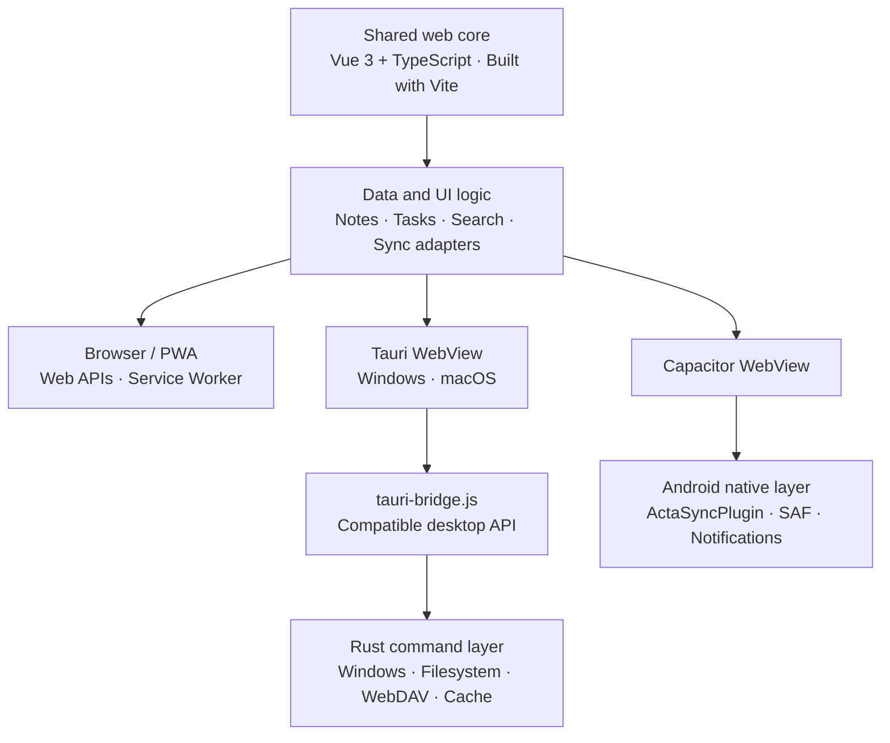

<p align="right">
  <a href="./README.md">简体中文</a> · <strong>English</strong>
</p>

<p align="center">
  
</p>

<p align="center">
  <strong>Current version v3.5.0</strong>
</p>

Acta is a local-first notes and tasks app that brings writing, action, and organization into one calm workspace. The project shares a single web interface across Tauri desktop apps for Windows/macOS, a Capacitor Android app, and a modern-browser PWA.


## Features

- Bidirectional links between notes and tasks, with navigation and unlinking from either editor
- High, medium, and low task priorities, plus subtasks, progress, immutable creation time, and optional start/due times
- Check-in tasks: generate from the create menu or quick capture, check in daily with streak/total counters and a last-7-days strip, optional start/due dates that feed the calendar, and a today badge on list cards
- Ordered subtasks: turn on "In order" to arrange subtasks by number and reorder them with arrow buttons; the default stays unordered
- Bulk subtask add & export: the editor's progress row offers "Quick-add subtasks" (one per line — paste a multi-line list and append them all at once) and "Export subtasks" (plain lines or a Markdown task list, copied to the clipboard or saved as a TXT / Markdown file)
- Ordered subtasks can be reordered with arrow buttons or by dragging the leading number (checking a step auto-completes earlier unchecked ones); subtasks record their completion time and show the date next to the checkbox (hover for the exact timestamp, toggleable in settings); in unordered mode a checked row lingers briefly, then slides into — or fades into — the bottom collapsed group (sharing the delay setting with the list); clicking "Add a subtask" focuses the new row and scrolls it into view; folder views offer a "Show completed" switch; completed tasks wait a moment before settling (delay and switch configurable in task settings), leaving time to undo: where completed items stay visible they glide to the end of the list with a fluid, non-linear motion, and in views like the inbox they fade out after the pause
- An action history dialog in the lower-left dock lists recent operations (creation, deletion, completion, check-ins, subtask changes, classifications — up to 500 entries); entries about a specific item restore that item to the state before the action after an inline confirmation; data statistics moved into the workspace settings page; deleting a subtask requires a two-step inline confirmation
- A year/month/week/day calendar replacing Today: week numbers in the compact month view, independently scrollable desktop/mobile week layouts, and direct task/subtask completion in week and day views
- A summary page (formerly statistics) as a notes-and-tasks list: gather items created in a chosen period, list every subtask in full, tick some, and make a list picture in one click; a "Data statistics" dialog in the sidebar's lower-left dock reports the profile's total file size, file count, notes, tasks, classifications, and trash count
- A note base font-size slider that scales body text and every heading level together; heading size and heading font remain independently adjustable (serif, rounded, monospace, or a custom font), with separate sliders for in-paragraph line spacing and paragraph spacing; Markdown syntax typed in the visual editor (headings, lists, quotes, bold/italic, and more) applies instantly
- First-run OOBE onboarding: set the software data folder, theme and interface font, and launch animation step by step; it can be re-run from general settings, and the software data location can be changed later. App-icon switching is an Android-only feature with four built-in presets (desktop builds always use the bundled default icon)
- MWS Light / MWS Dark brand themes (primary #FF6666, secondary #66CC66; the light theme paints the sidebar and titlebar in the brand colors) plus three previewable launch animations with a playback-speed control
- Deleting offers move-to-trash or delete-now; the trash is never emptied automatically and supports restore, delete-forever, and empty-all
- Folders, smart views, combinable task/note filters, and unified search
- Rich-text editing and UTF-8 Markdown import/export for individual notes
- A desktop context menu on an opaque panel, with cut, copy, paste, and select all for text, plus copy for any selected text
- Simplified Chinese, Traditional Chinese, and English interfaces with theme and font settings
- All dropdown menus, scrollbars, sliders, date-time pickers, and settings toggles are custom-drawn controls; hover feedback uses scale instead of shifting, keeping motion restrained and smooth
- Local data folders, WebDAV, and Acta LAN sync (BETA): desktop and Android clients can automatically discover other Acta devices on the same network and exchange complete data folders directly. Both sides can pick the exact data profiles involved, and choose between replacing a specific profile or copying the data in as a new one; pushes use two-stage confirmation (the other device first gets a notification, then a detailed consent dialog), and devices with "Trust this network" enabled confirm automatically; transfers show per-step progress, and a restorable backup is created automatically before anything is overwritten
- Android local notifications, system file pickers, and Storage Access Framework integration
- Installable PWA support with offline caching

## Quick start

Web development only needs Node.js 22+ and npm; desktop development additionally requires Rust stable and the Tauri system dependencies for the host platform.

```bash
npm install
npm run dev        # Vite dev server, open http://localhost:5173
npm start          # Tauri desktop app (starts the Vite dev server automatically)
```

Common commands:

| Command | Purpose |
| --- | --- |
| `npm run dev` | Start the Vite dev server for web development |
| `npm run build` | Build the shared web assets into `dist/` |
| `npm run preview` | Preview the built output locally |
| `npm run typecheck` | Run strict type checking via vue-tsc |
| `npm start` | Start the Tauri desktop app |
| `npm test` | Run the headless smoke test through a Vite dev server (local Edge/Chrome) |
| `npm run desktop:build` | Build the desktop app for the current platform (runs `vite build` first) |
| `npm run windows:build` | Build the Windows x64 NSIS installer |
| `npm run macos:build` | Build an Apple Silicon (aarch64) macOS App and DMG on macOS |
| `npm run build:pages` | Build the PWA site into `docs/` (GitHub Pages) |
| `npm run android:sync` | Build the web assets and sync them into the Android project |
| `npm run android:build` | Sync assets and build an Android debug APK |

Android builds require JDK 21, Android SDK 36, and Node.js 22 (Capacitor 8 requirements). The debug APK is generated at `android/app/build/outputs/apk/debug/app-debug.apk` and is not committed to the source repository.

## Architecture

Acta follows a “shared web core + platform adapters” design. Notes, tasks, views, and most synchronization logic have a single implementation. Platform layers only provide system capabilities such as windows, file pickers, directory access, network proxying, and notifications.



### Repository layout

The web app uses Vite 8 + Vue 3 + TypeScript: the root `index.html` is the Vite entry (SVG icon sprite + the `#app` mount point), the entire application shell is the template of `src/App.vue`, mounted by `src/main.ts`. The existing business modules keep their original form and are booted in the original script order by `src/boot.ts`; `public/legacy/renderer.js` stays a classic script because it exports page-level global bindings (`library`, `settings`, `renderAll`, …) and serves as the shared data layer. New code should live under `src/` (Vue SFCs or TypeScript), gradually replacing modules in `src/legacy/`.

| Path | Responsibility |
| --- | --- |
| `index.html` | Vite entry page: inline scripts, icon sprite, and the mount point |
| `src/` | Vue 3 + TypeScript app source: `App.vue` shell template, `main.ts` / `boot.ts` boot chain, shared styles |
| `src/legacy/` | Existing business modules (loaded as ES modules, files unchanged) |
| `public/` | Static assets copied verbatim: `legacy/renderer.js`, vendor libraries, icons, manifest, service worker, theme-boot |
| `dist/` | `vite build` output (the input for Capacitor `webDir` and Tauri `frontendDist`, not committed) |
| `src-tauri/` | Tauri 2 configuration, Rust commands, desktop permissions, and Windows/macOS icons |
| `android/` | Capacitor Android project and the native `ActaSyncPlugin` file bridge (Capacitor config: `capacitor.config.ts` at the repository root) |
| `scripts/` | Headless-browser smoke tests, preview screenshots, and Android icon generation |

### Platform build configuration

The desktop build merges a platform-specific config over the shared base. Platform-dedicated files are marked separately below:

| File | Platform | Notes |
| --- | --- | --- |
| `src-tauri/tauri.conf.json` | Shared base | Product name, identifier, icons, and other shared settings |
| `src-tauri/tauri.macos.conf.json` | **macOS only** | Overlay title bar with traffic-light position, macOS 10.13 minimum, `.app` and `.dmg` bundles |
| `src-tauri/tauri.windows.conf.json` | **Windows only** | NSIS installer, WebView2 bootstrapper, and installer language selector |

The macOS build targets Apple Silicon (`aarch64-apple-darwin`), set by the `macos:build` script in `package.json`. For Intel or universal binaries, switch the target to `x86_64-apple-darwin` or `universal-apple-darwin`.

### Continuous integration

Builds run automatically through GitHub Actions (`.github/workflows/build.yml`): every push to `main` and every `v*` tag triggers a build of the Windows portable exe, macOS DMG, and Android APK, with artifacts attached to the workflow run. `v*` tag builds are additionally published as a GitHub Release; consecutive pushes to the same branch cancel the previous unfinished build.

### Data and synchronization

- Core data stays on the device by default; browser settings use `localStorage`, while directory handles use IndexedDB. Since v3.0.0 the desktop app keeps its software data next to the program by default (the `data` folder beside the exe), or in a location you choose, mirrored into `settings.json` there so it survives cache clears.
- A data folder contains `acta-manifest.json`, `classifications.json`, `notes/`, and `todos/`, with each note and task stored separately.
- Tauri uses restricted Rust commands for system files, WebDAV, LAN sync, and cache management; Android uses a custom Capacitor plugin and the Storage Access Framework for user-authorized directories, with LAN sync implemented natively in the ActaLan plugin using the same protocol v2; the Android app is portrait-only.
- WebDAV credentials are used only for the server configured by the user. LAN sync runs only while "Be discoverable" is on, and both discovery and transfer require the random session token; incoming pushes require two-step confirmation in the interface by default (devices with "Trust this network" enabled accept automatically), and a complete, restorable backup is created under `backups/lan-sync/` in the software data folder before anything is overwritten (the latest 10 are kept automatically).

## Testing

```bash
npm test
```

The smoke test starts a Vite dev server programmatically and then drives the app in headless Edge/Chrome. It covers default task classification, creation/start/due times, mobile calendar interaction, week-list scrolling, direct task/subtask completion, IME composition, strict view filtering, bidirectional links, OOBE onboarding, custom select menus, MWS themes, launch-animation speed semantics, the mobile app-icon presets, check-in tasks, ordered subtasks, and Markdown round-trips.

## Troubleshooting

### macOS says the app "is damaged and can't be opened"

Acta's macOS builds are not code-signed or notarized by Apple, so a DMG downloaded through a browser gets the system quarantine attribute; after dragging the app out, Gatekeeper may report it as damaged. If you trust the download source, clear the attribute in Terminal and open the app again (replace the path with your actual install location):

```bash
sudo xattr -r -d com.apple.quarantine "/Applications/Acta · 行记.app"
```

A `No such xattr` message for individual files just means that file had no quarantine attribute and can be ignored. The build pipeline also runs the same cleanup on its packaged output so downloads are less likely to trigger this.

## License

This project is licensed under the [MIT License](./LICENSE).
